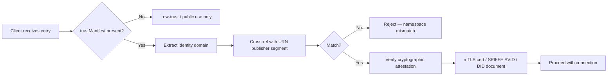

# Identity and Trust

Trust is optional for simple cases; required for enterprise compliance. The `trustManifest` object can appear at the catalog entry level and at the host level.

## trustManifest Object

| Field | Type | Required | Notes |
|-------|------|----------|-------|
| `identity` | String | Yes | Globally unique cryptographic workload identifier |
| `identityType` | String | No | Type hint: `"did"`, `"spiffe"`, `"https"` |
| `attestations` | Array | No | Verifiable compliance claims |
| `provenance` | Array | No | Lineage / source records |
| `signature` | String | No | Detached JWS over `trustManifest` content |

### Identity Types

| Type | Example |
|------|---------|
| SPIFFE | `spiffe://acme.com/travel/concierge` |
| DID | `did:web:acme.com` |
| HTTPS | `https://acme.com` |

The cryptographic trust domain in `identity` **must** align with the FQDN in the entry's `identifier` URN `<publisher>` segment. Registries cross-reference these to prevent namespace squatting.

## Attestation Object

| Field | Type | Required | Notes |
|-------|------|----------|-------|
| `type` | String | Yes | Compliance type (e.g. `SOC2-Type2`, `HIPAA-Audit`, `GDPR`) |
| `uri` | String | Yes | URL to attestation document |
| `digest` | String | No | Cryptographic hash for integrity |

## Provenance Link Object

| Field | Type | Required | Notes |
|-------|------|----------|-------|
| `relation` | String | Yes | e.g. `derivedFrom`, `publishedFrom` |
| `sourceId` | String | Yes | Identifier of the source artifact |
| `sourceDigest` | String | No | Hash of source for verification |

## Enterprise Example

```json
{
  "identifier": "urn:air:acme.com:travel:concierge",
  "displayName": "Travel Concierge",
  "type": "application/a2a-agent-card+json",
  "url": "https://api.acme.com/travel/concierge.json",
  "description": "AI-powered travel planning",
  "trustManifest": {
    "identity": "spiffe://acme.com/travel/concierge",
    "identityType": "spiffe",
    "attestations": [
      {
        "type": "SPIFFE-X509",
        "uri": "https://acme.com/.well-known/spiffe/jwks"
      },
      {
        "type": "SOC2-Type2",
        "uri": "https://trust.acme.com/reports/soc2.pdf"
      },
      {
        "type": "GDPR",
        "uri": "https://trust.acme.com/compliance/gdpr"
      }
    ]
  }
}
```

## Verification Flow



## Filtering by Trust in Search

```json
{
  "query": {
    "text": "expense filing agent",
    "filter": {
      "trustManifest.attestations.type": ["SOC2-Type2", "HIPAA-Audit"]
    }
  }
}
```

Attestation type array is OR within the key; combine with other filter keys using AND.

## Key Design Decisions

- Authentication is **delegated** to the artifact's native protocol (MCP, A2A, etc.); ARD only carries identity metadata.
- `score` from Search is semantic relevance only — **never** a trust or safety rating.
- For full signature verification procedures, refer to the [ai-catalog specification](https://github.com/Agent-Card/ai-catalog).
