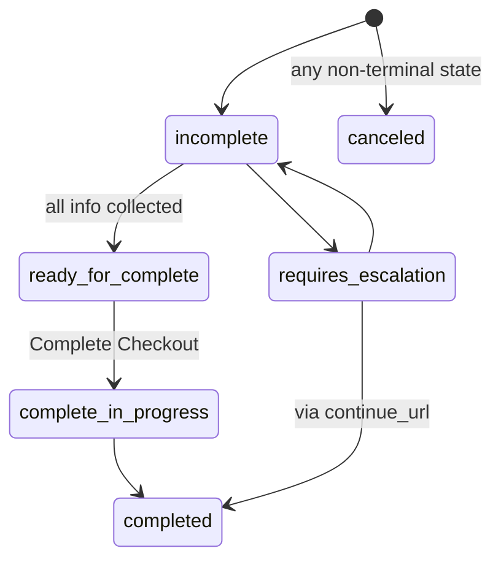

# Capabilities & Checkout

## Standard Capabilities

| Capability | Notes |
|------------|-------|
| `dev.ucp.shopping.cart` | Pre-intent basket building; today limited to `CreateCart` |
| `dev.ucp.shopping.checkout` | Full checkout session: line items, tax, payment, order placement |
| `dev.ucp.shopping.catalog.search` / `.catalog.lookup` | Catalog search and product-by-id lookup |
| `dev.ucp.shopping.order` | Async order lifecycle webhooks |
| `dev.ucp.common.identity_linking` | OAuth 2.0 account linking |

## Extensions

| Extension | Extends | Adds |
|-----------|---------|------|
| `dev.ucp.shopping.discount` | checkout, cart | Discount codes/promotions |
| `dev.ucp.shopping.fulfillment` | checkout | Shipping/delivery/pickup options |
| `dev.ucp.shopping.payment_authentication` | checkout | Device data collection, 3DS challenges |
| `dev.ucp.shopping.ap2_mandate` | checkout | Non-repudiable authorization for autonomous agents |
| `dev.ucp.shopping.buyer_consent` | checkout, cart | Explicit consent capture |

An extension whose declared parent capability is not in the negotiated intersection MUST be pruned — never activate `discount` without an active `checkout`.

## Checkout Operations

| Operation | Method & Path | Trigger |
|-----------|---------------|---------|
| Create Checkout | `POST /checkout-sessions` | User expresses purchase intent (e.g. "Buy") |
| Get Checkout | `GET /checkout-sessions/{id}` | Platform polls/resumes session state |
| Update Checkout | `PUT /checkout-sessions/{id}` | Full replacement - platform resends the entire desired state |
| Complete Checkout | `POST /checkout-sessions/{id}/complete` | Buyer commits to pay; response's `order` field is populated |
| Cancel Checkout | `POST /checkout-sessions/{id}/cancel` | Any non-terminal session SHOULD be cancelable |

## Status Lifecycle

| Status | Your obligation |
|--------|-------------------|
| `incomplete` | Surface recoverable issues in `messages`; wait for Update |
| `requires_escalation` | MUST provide `continue_url`; MUST include ≥1 message with `requires_buyer_input`/`requires_buyer_review` severity |
| `ready_for_complete` | Session valid; platform may call Complete |
| `complete_in_progress` | You're processing; platform may poll Get |
| `completed` | MUST send a confirmation email; session becomes immutable |
| `canceled` | Terminal; can occur from any non-terminal state |

## Error Messages

`messages[]` entries share `type` (`error`/`warning`/`info`), `code`, optional `path` (RFC 9535 JSONPath), `content`, `content_type` (`plain`/`markdown`). Errors add `severity`:

| Severity | Meaning | Platform does |
|----------|---------|----------------|
| `recoverable` | You can resolve via Update + retry | Modify inputs, retry |
| `requires_buyer_input` | Your API can't collect this programmatically | Hand off via `continue_url` |
| `requires_buyer_review` | Policy/regulatory authorization needed | Hand off via `continue_url` |
| `unrecoverable` | No valid resource to act on | Retry fresh, or hand off |

Standard error codes (mark `severity: recoverable` so platforms give targeted UX): `out_of_stock`, `item_unavailable`, `address_undeliverable`, `payment_failed`, `eligibility_invalid`.

`ucp.status` is the response discriminator: `"success"` means the expected payload is present; `"error"` means only `messages` (+ optional `continue_url`) are returned, no resource.

## Totals — You Are Authoritative

Platforms render your `totals[]` verbatim, in order — never recompute, reorder, or aggregate them yourself.

- Exactly one `type: "subtotal"` and exactly one `type: "total"` MUST be present.
- Sign is intrinsic: subtractive types (`discount`, `items_discount`) are negative; additive types (`fulfillment`, `tax`, `fee`) are non-negative.
- Unknown (non-well-known) `type` values MUST include `display_text`.
- Optional `lines[]` sub-breakdowns MUST sum to the parent entry's `amount`.

## Warning Presentation

Set `presentation` on warnings: `"notice"` (default, dismissible banner) or `"disclosure"` (allergens, Prop 65, energy labels — platform MUST render in proximity to `path`, MUST NOT auto-dismiss, MUST render `image_url`). Provide `code`, `image_url`, and `url` for disclosures where applicable.

## Eligibility Claims

Platforms send provisional buyer claims via `context.eligibility` (e.g. loyalty membership). You MAY apply pricing provisionally, but MUST verify all accepted claims before completion — unresolved claims block completion. On failure, return `eligibility_invalid` (`severity: recoverable`) with `path` pointing at the claim; the platform resubmits proof or drops the claim.

## Order Webhooks (brief)

The `dev.ucp.shopping.order` capability pushes async lifecycle events (created, shipped, delivered, adjustments) to each linked platform's `config.webhook_url` (declared in *their* profile). Google's specific webhook contract is in [google-merchant-integration.md](google-merchant-integration.md).

## Identity Linking (OAuth 2.0)

- Declare `dev.ucp.common.identity_linking` with `config.scopes`, e.g. `dev.ucp.shopping.checkout:manage`, `dev.ucp.shopping.order:read`, `dev.ucp.shopping.order:manage`.
- Publish OAuth 2.0 Authorization Server Metadata at `/.well-known/oauth-authorization-server`.
- Platforms send `Authorization: Bearer <token>` on checkout/order operations once linked.
- Errors: `identity_required` (401 + `WWW-Authenticate: Bearer realm="..."`, add `error="invalid_token"` if a token was present but invalid/expired), `insufficient_scope` (403 + `WWW-Authenticate` with `error="insufficient_scope"` and `scope="..."`).
- Guest checkout remains the default fallback when identity linking isn't implemented or not yet linked.
