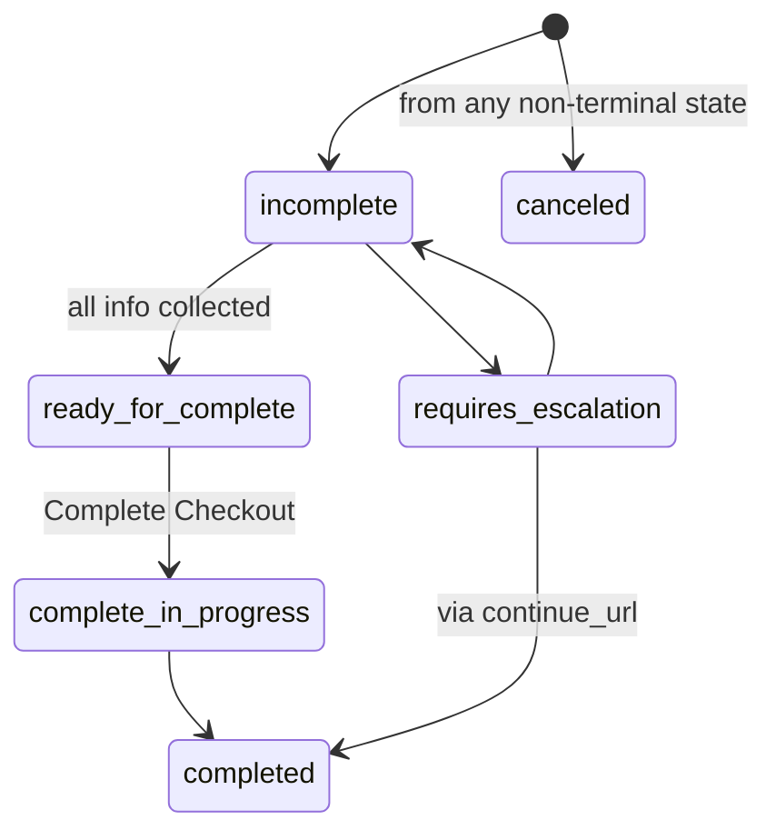

# Checkout Flow

## Operations

| Operation | Notes |
|-----------|-------|
| Create | Call on purchase intent. Product data you supply via feeds SHOULD match what comes back - minimize discrepancies. |
| Get | Refresh/poll state, e.g. while `complete_in_progress`. |
| Update | **Full replacement** - resend every field you want retained, not just the delta. |
| Complete | Final placement. The response's `order.id`/`order.permalink_url` is your durable reference going forward. |
| Cancel | Only valid while status isn't already `completed`/`canceled`. |

## Status Lifecycle



| Status | You do |
|--------|--------|
| `incomplete` | Inspect `messages`; fix `recoverable` issues via Update |
| `requires_escalation` | Hand off via `continue_url` (business guarantees ≥1 `requires_buyer_input`/`requires_buyer_review` message) |
| `ready_for_complete` | Call Complete |
| `complete_in_progress` | Poll Get, or wait for the business's async result |
| `completed` / `canceled` | Terminal - start a new session to keep transacting |

## Error Processing Algorithm

```text
errors = messages where type == "error"
partition by severity: recoverable | requires_buyer_input | requires_buyer_review | unrecoverable

if unrecoverable is non-empty:
    retry with a new resource/inputs, or hand off via continue_url
elif recoverable is non-empty:
    fix inputs, call Update Checkout, re-evaluate the response
elif requires_buyer_input or requires_buyer_review is non-empty:
    hand off to the buyer via continue_url
```

Resolve `recoverable` errors before initiating any handoff — don't escalate prematurely.

Standard error codes — give each specific UX, not a generic error toast: `out_of_stock`, `item_unavailable`, `address_undeliverable`, `payment_failed`, `eligibility_invalid`.

## Totals — Never Recompute

- Render every top-level `totals[]` entry in the order given; use `display_text` when present.
- You MAY sum-check (`sum(non-total entries) == total`), but on mismatch you MUST NOT silently alter what's displayed — reject the checkout or escalate for buyer review instead.
- Exactly one `subtotal` + one `total` are guaranteed; sign is intrinsic to the amount (discounts arrive negative).
- Optional `lines[]` sub-breakdowns are supplementary detail — render them when present, but the top-level entry is what's authoritative.

## Warning Presentation Contract

| Presentation | Display | Proximity to `path` | Dismissible | Render `image_url` |
|--------------|---------|----------------------|-------------|----------------------|
| `notice` (default) | MUST | MAY | MAY | MAY |
| `disclosure` | MUST | MUST | MUST NOT | MUST |

If you can't honor a `disclosure`'s rendering contract, escalate to the merchant UI via `continue_url` — don't silently downgrade it to a dismissible notice.

## continue_url Handoff

- REQUIRED whenever status is `requires_escalation`; SHOULD be present on other non-terminal statuses too.
- Prefer the business-provided `continue_url` over any permalink you construct yourself.
- Two shapes: an opaque server-side session link, or a stateless "checkout permalink" you can prefill for a buy-now flow.

## Eligibility Claims

Claims you assert via `context.eligibility` (e.g. loyalty membership) are provisional — the business may apply pricing provisionally but must verify at completion. On `eligibility_invalid` (`severity: recoverable`), either supply valid proof and resubmit, or remove the claim from `context.eligibility` and let the business recompute without it.
